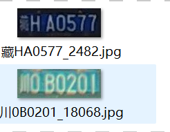
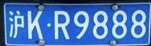
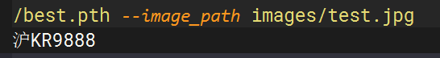
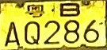
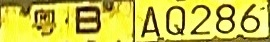

# License plate recognition

**License Plate Detection and License Plate Recognition Reasoning Here:[License Plate Detection and Recognition](https://github.com/201918010332Thomas/ANPR)**

**License plate recognition training here: [License plate recognition](https://github.com/201918010332Thomas/CRNN_LPR)**


| Model  | Accuracy | Speed(ms) | Model size(MB) | link                                                    |
| ------ | -------- | --------- | -------------- | ------------------------------------------------------- |
| small  | 96.82%   | 1.2ms     | 0.67           | [ezhe](https://pan.baidu.com/s/1IsQNPSRuW7bXNWc2ULfFLg) |
| medium | 98.21%   | 1.5ms     | 2.5            | [foxg](https://pan.baidu.com/s/1DSoJ-wWymDemf5lE2xCNLw) |
| big    | 98.46%   | 1.6ms     | 7.3            | [ssmx](https://pan.baidu.com/s/1F6Y0AUVnIt4YYWLE4gDrIw) |

When training, select the corresponding cfg to select the size of the model.

train.py

```
 # construct face related neural networks
    #cfg =[8,8,16,16,'M',32,32,'M',48,48,'M',64,128] #small model
    # cfg =[16,16,32,32,'M',64,64,'M',96,96,'M',128,256]#medium model
    cfg =[32,32,64,64,'M',128,128,'M',196,196,'M',256,256] #big model
    model = myNet_ocr(num_classes=len(plate_chr),cfg=cfg)
```

## Environmental configuration

1. Windows 10 or Ubuntu 16.04
2. **PyTorch > 1.2.0 (may fix ctc loss)**🔥
3. yaml
4. easydict
5. tensorboardX

## Dataset

#### The license plate recognition dataset uses CCPD and CRPD

1. The license plate screenshots from CCPD and CRPD, as well as some of the license plates I collected myself. [dataset](https://pan.baidu.com/s/1xT-F3E5U3ul3o6gu6Zk94g)  提取码：g08q
2. Label the dataset and generate train.txt and val.txt files.

   

   The image is named as shown in the above image: license plate number_ Serial number. jpg
   Then execute the following command to obtain train.txt and val.txt.

   ```
   python plateLabel.py --image_path your/train/img/path/ --label_file datasets/train.txt
   python plateLabel.py --image_path your/val/img/path/ --label_file datasets/val.txt
   ```

   The data format is as follows:

   train.txt

   ```
   /mnt/Gu/trainData/plate/new_git_train/CCPD_CRPD_ALL/冀BAJ731_3.jpg 5 53 52 60 49 45 43 
   /mnt/Gu/trainData/plate/new_git_train/CCPD_CRPD_ALL/冀BD387U_2454.jpg 5 53 55 45 50 49 70 
   /mnt/Gu/trainData/plate/new_git_train/CCPD_CRPD_ALL/冀BG150C_3.jpg 5 53 58 43 47 42 54 
   /mnt/Gu/trainData/plate/new_git_train/CCPD_CRPD_OTHER_ALL/皖A656V3_8090.jpg 13 52 48 47 48 71 45 
   /mnt/Gu/trainData/plate/new_git_train/CCPD_CRPD_OTHER_ALL/皖C91546_7979.jpg 13 54 51 43 47 46 48 
   /mnt/Gu/trainData/plate/new_git_train/CCPD_CRPD_OTHER_ALL/皖G88950_1540.jpg 13 58 50 50 51 47 42 
   /mnt/Gu/trainData/plate/new_git_train/CCPD_CRPD_OTHER_ALL/皖GX9Y56_2113.jpg 13 58 73 51 74 47 48 
   ```
3. Write the train.txt val.txt path to lib/config/360CC_ In config.yaml.

   ```
   DATASET:
     DATASET: 360CC
     ROOT: ""
     CHAR_FILE: 'lib/dataset/txt/plate2.txt'
     JSON_FILE: {'train': 'datasets/train.txt', 'val': 'datasets/val.txt'}
   ```

## Train

```angular2html
python train.py --cfg lib/config/360CC_config.yaml
```

Save the results in the output folder.

## Test demo

```

python demo.py --model_path saved_model/best.pth --image_path images/test.jpg
                                   or your/model/path
```



The result is:



## Export onnx

```

python export.py --weights saved_model/best.pth --save_path saved_model/best.onnx  --simplify

```

#### Onnx inference

```
python onnx_infer.py --onnx_file saved_model/best.onnx  --image_path images/test.jpg
```

## Double layer license plate recognition

The double-layer license plate is spliced into a single-layer license plate here:

python:

```
def get_split_merge(img):
    h,w,c = img.shape
    img_upper = img[0:int(5/12*h),:]
    img_lower = img[int(1/3*h):,:]
    img_upper = cv2.resize(img_upper,(img_lower.shape[1],img_lower.shape[0]))
    new_img = np.hstack((img_upper,img_lower))
    return new_img
```

c++:

```
cv::Mat get_split_merge(cv::Mat &img)   //双层车牌 分割 拼接
{
    cv::Rect  upper_rect_area = cv::Rect(0,0,img.cols,int(5.0/12*img.rows));
    cv::Rect  lower_rect_area = cv::Rect(0,int(1.0/3*img.rows),img.cols,img.rows-int(1.0/3*img.rows));
    cv::Mat img_upper = img(upper_rect_area);
    cv::Mat img_lower =img(lower_rect_area);
    cv::resize(img_upper,img_upper,img_lower.size());
    cv::Mat out(img_lower.rows,img_lower.cols+img_upper.cols, CV_8UC3, cv::Scalar(114, 114, 114));
    img_upper.copyTo(out(cv::Rect(0,0,img_upper.cols,img_upper.rows)));
    img_lower.copyTo(out(cv::Rect(img_upper.cols,0,img_lower.cols,img_lower.rows)));
    return out;
}
```

  Obtained through transformation 

## Train your own dataset

1. Modify alphabets.py to your own character set, plateName, plate_ Chr needs to be modified, plate_ Chr has an empty placeholder '#' added.
2. Generate train.txt, val.txt through plateLabel.py.
3. train

## Data enhancement

```
cd Text-Image-Augmentation-python-master

python demo1.py --src_path /mnt/Gu/trainData/test_aug --dst_path /mnt/Gu/trainData/result_aug/
```

Src_ path is the source data path, dst_path is the saved data path.

**Then put the two pieces of data together for training, the effect will be much better!**

## References

- https://github.com/meijieru/crnn.pytorch
- [https://github.com/Sierkinhane/CRNN_Chinese_Characters_Rec](https://github.com/Sierkinhane/CRNN_Chinese_Characters_Rec)
